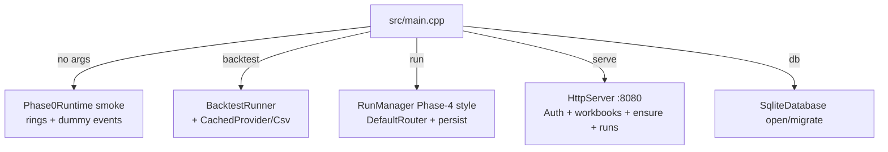
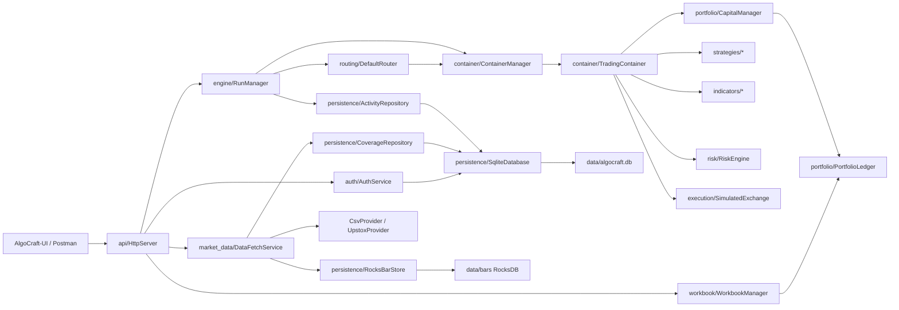
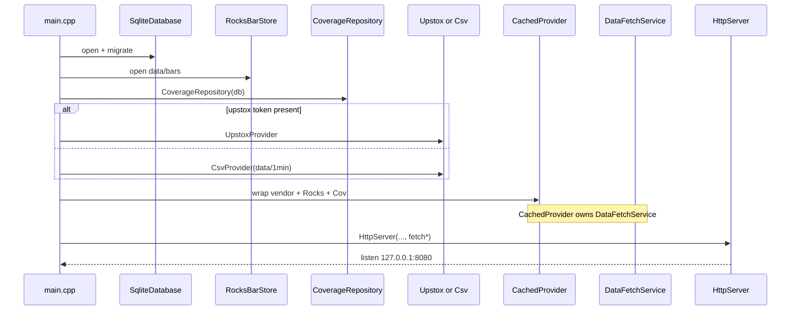
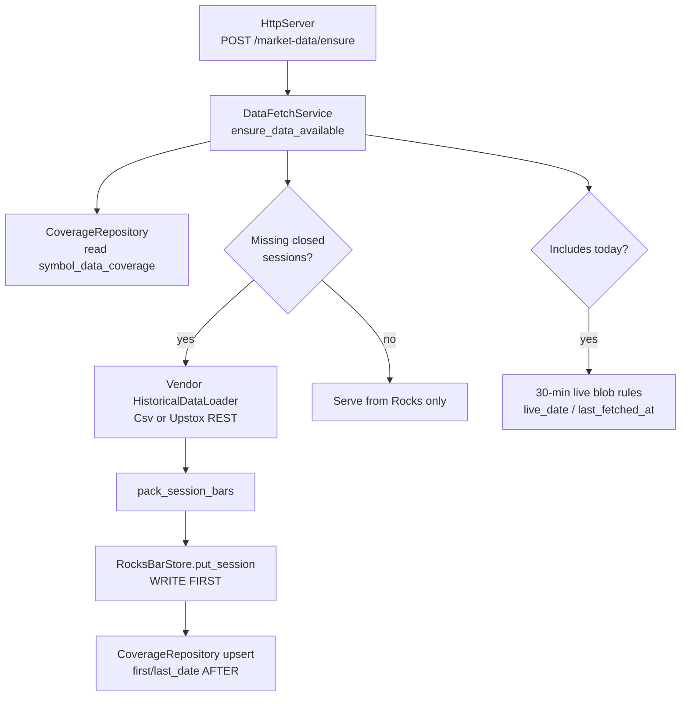
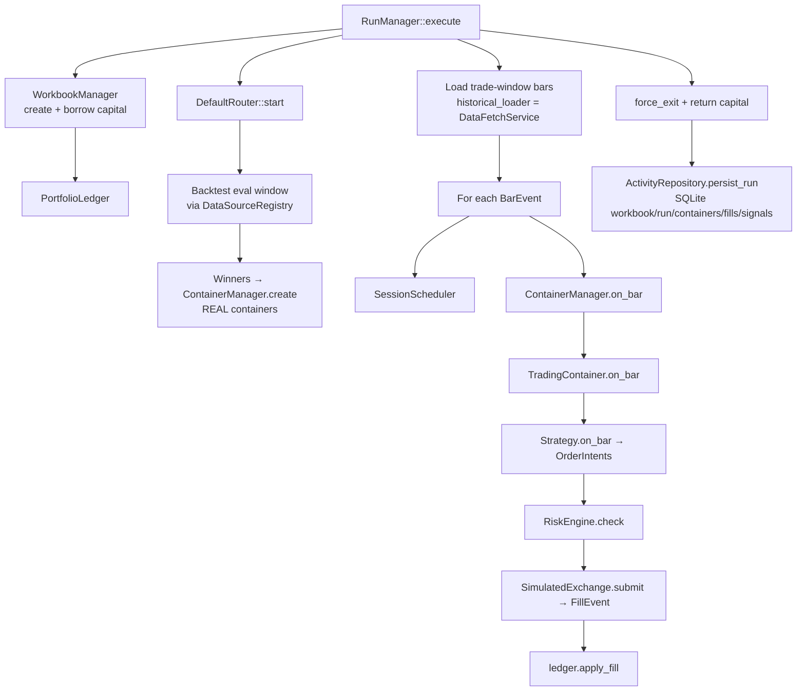
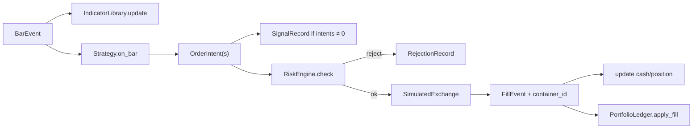
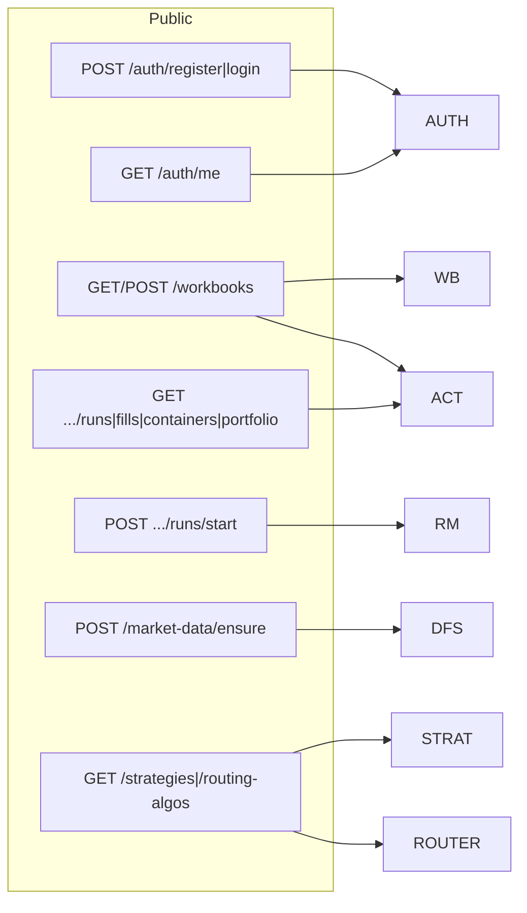
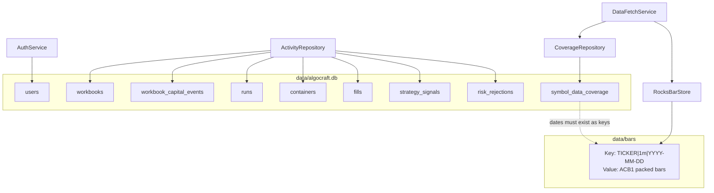

# AlgoCraft Code Map (through Phase 5)

ARCHITECTURE.md / IMPLEMENTATION.md / PHASE5.md describe **intent**.  
This file maps **what exists in the repo today**: every important source file, what it does, and how it connects.

Open this in any Markdown viewer that supports Mermaid (GitHub, VS Code, Cursor).

---

## 1. How to read this

| Layer | Job |
|-------|-----|
| `src/main.cpp` | Process entry: CLI modes + wires stores/providers into a run or HTTP server |
| `api/` + `auth/` | HTTP surface (Thread-4 style). No trading in handlers beyond calling managers |
| `engine/` | Orchestrates a run (`RunManager`) and Phase-0 ring demo |
| `routing/` | Picks stocks × strategies, creates containers |
| `container/` | Per-symbol strategy lifecycle: bars → intents → risk → fills |
| `strategies/` + `indicators/` | Pure signal logic |
| `execution/` | Simulated fills + NSE costs |
| `portfolio/` + `workbook/` + `risk/` | Capital + risk rules |
| `market_data/` | Vendor loaders + cache (`DataFetchService`) |
| `persistence/` | SQLite + RocksDB + packed bars |
| `domain/` | Shared types only (no I/O) |

On disk:

| Path | Role |
|------|------|
| `data/algocraft.db` | SQLite (users, workbooks, runs, fills, coverage, …) |
| `data/bars/` | RocksDB session blobs `{ticker}\|1m\|YYYY-MM-DD` |
| `data/1min/*.csv` | Offline CSV vendor dump (CsvProvider) |
| `migrations/schema_*.sql` | Ordered schema upgrades |
| `~/.config/upstox/config.json` | Upstox Bearer token (never in repo) |

---

## 2. Process entry: what `main` can start

| CLI | Code path |
|-----|-----------|
| `./algocraft_engine` | `Phase0Runtime` |
| `./algocraft_engine backtest [dir]` | `BacktestRunner` + strategies |
| `./algocraft_engine run [dir]` | `RunManager::execute` + `ActivityRepository` |
| `./algocraft_engine serve [dir] [port]` | `HttpServer` (Upstox if token else CSV) |
| `./algocraft_engine db [path]` | migrate smoke |

---

## 3. Big-picture dependency (modules)

---

## 4. End-to-end flows (what actually runs)

### 4.1 `serve` boot

### 4.2 Market data ensure (`POST /market-data/ensure`)

Key files: `data_fetch_service.cpp`, `rocks_bar_store.cpp`, `packed_bars.cpp`, `coverage_repository.cpp`, `upstox_provider.cpp` / `csv_provider.cpp`.

### 4.3 Start a run (`POST /workbooks/{id}/runs/start` or CLI `run`)

### 4.4 One bar inside a container (hot path intent)

---

## 5. File catalog (by module)

Headers live under `include/algocraft/…`. Matching `.cpp` under `src/…` unless noted “header-only”.

### 5.1 Entry

| File | Contains | Talks to |
|------|----------|----------|
| `src/main.cpp` | CLI modes; builds `EngineCache` (SQLite+Rocks+Coverage); wraps CSV/Upstox in `CachedProvider`; starts `HttpServer` / `RunManager` / backtests | Almost everything at wiring level |

### 5.2 API + Auth

| File | Contains | Talks to |
|------|----------|----------|
| `api/http_server.hpp/.cpp` | Crow listen/start/stop; registers route modules | `api::register_*_routes` |
| `api/http_helpers.hpp/.cpp` | CORS app type, JSON helpers, `require_user` / `require_workbook` | Crow, `AuthService`, `WorkbookRepository` |
| `api/auth_routes.hpp/.cpp` | `/auth/register`, `/auth/login`, `/auth/me` | `AuthService` |
| `api/market_routes.hpp/.cpp` | `/strategies`, `/routing-algos`, `/market-data/ensure` | registries + `DataFetchService` |
| `api/workbook_routes.hpp/.cpp` | `/workbooks*`, `/ws/workbooks*`, runs/start | repos + `RunManager` |
| `persistence/workbook_repository.hpp/.cpp` | SQLite workbook create/list/find/access checks used by the API | `sqlite3` |
| `auth/auth_service.hpp/.cpp` | Register/login; PBKDF2 password hash; HS256 JWT | `SqliteDatabase` (`users` table) |

### 5.3 Engine

| File | Contains | Talks to |
|------|----------|----------|
| `engine/run_manager.hpp/.cpp` | Full workbook run: borrow → router → replay tape → settle → optional persist | `WorkbookManager`, `ContainerManager`, `DefaultRouter`, `DataSourceRegistry`, `ActivityRepository`, `SessionScheduler`, `RiskEngine`, `SimulatedExchange` |
| `engine/phase0_runtime.hpp/.cpp` | 5-thread ring-buffer smoke | `SpscRing`, `AsyncLogger` |
| `engine/spsc_ring.hpp` | Lock-free SPSC queue | Used by Phase0 / logging |
| `engine/memory_pool.hpp` | Fixed object pool | Phase0 / future hot path |
| `engine/engine_thread.hpp` | Named thread wrapper | Phase0 |
| `engine/dummy_event.hpp` | Dummy payload for Phase0 | Phase0 |

### 5.4 Routing

| File | Contains | Talks to |
|------|----------|----------|
| `routing/routing_algo.hpp` | Base router interface + `RoutingConfig` | Containers, data, strategies |
| `routing/default_router.hpp/.cpp` | Eval each stock×strategy; promote winners to REAL | `BacktestRunner` path via registry loaders; `ContainerManager` |
| `routing/routing_algo_registry.hpp/.cpp` | Factory for routers by name | `DefaultRouter` |
| `routing/position_sizer.hpp` | Shares from capital + price | `ContainerManager` on create |

### 5.5 Containers

| File | Contains | Talks to |
|------|----------|----------|
| `container/container_manager.hpp/.cpp` | Create/kill/upgrade containers; dispatch `on_bar`; collect signals/rejections | `TradingContainer`, `RiskEngine`, `CapitalManager`, `StrategyRegistry` |
| `container/trading_container.hpp/.cpp` | Lifecycle + on_bar/on_fill; signal/rejection logs | `Strategy`, `IndicatorLibrary`, `RiskEngine`, `ExecutionVenue`, `CapitalManager` |

### 5.6 Strategies + indicators

| File | Contains | Talks to |
|------|----------|----------|
| `strategies/strategy.hpp` | Strategy interface + metadata | Containers |
| `strategies/strategy_registry.hpp` + `strategy_registrations.cpp` | Name → factory | `RunManager`, HTTP `/strategies`, backtests |
| `strategies/ema_crossover.*` | EMA cross strategy | EMA indicator |
| `strategies/vwap_reversion.*` | VWAP reversion | VWAP |
| `strategies/opening_range_breakout.*` | ORB | Bars only |
| `strategies/consecutive_up_clip.*` | Clip / consecutive-up | Bars + capital clip |
| `strategies/make_intent.hpp` | Helper to build `OrderIntent` | Strategies |
| `indicators/indicator.hpp` | Base indicator | Library |
| `indicators/indicator_library.hpp` | Per-symbol indicator cache (header-only) | Containers |
| `indicators/ema.*` `rsi.*` `vwap.*` | Concrete indicators | Strategies |

### 5.7 Execution + portfolio + risk + workbook

| File | Contains | Talks to |
|------|----------|----------|
| `execution/execution_venue.hpp` | Venue interface | Containers |
| `execution/simulated_exchange.*` | Slippage + costs + fills | `CostCalculator` |
| `execution/cost_calculator.*` | NSE fee model | Exchange |
| `portfolio/portfolio_ledger.*` | Activity capital + positions + fill list | Workbook borrow, containers |
| `portfolio/capital_manager.*` | Allocate/release/commit REAL | Ledger + containers |
| `portfolio/op_result.hpp` | ok/fail result type | Everywhere capital/risk |
| `risk/risk_engine.*` | Rules: size, daily loss, kill, hours, duplicate, MIS square-off | Containers |
| `workbook/workbook_manager.*` | In-memory workbooks + borrow/return + events | `RunManager`, HTTP |
| `scheduler/session_scheduler.hpp` | SESSION_START / MIS / SESSION_END from bar timestamps | `RunManager` |

### 5.8 Market data

| File | Contains | Talks to |
|------|----------|----------|
| `market_data/data_provider.hpp` | Abstract vendor | Registry |
| `market_data/historical_loader.hpp` | `load_bars(symbol, from, to, res)` | Fetch + backtest |
| `market_data/market_data_feed.hpp` | Live feed interface | Future paper |
| `market_data/null_live_feed.hpp` | No-op live feed | Placeholder Phase 5.9 |
| `market_data/data_source_registry.*` | Active provider by name | Engine / HTTP |
| `market_data/csv_provider.*` | CSV historical loader | Files under `data/1min/` |
| `market_data/upstox_provider.*` | Upstox v3 REST candles; ISIN map; rate limit | HTTPS + token file |
| `market_data/dummy_provider.*` | Phase0 dummy | Phase0 |
| `market_data/data_fetch_service.*` | Coverage logic A/B/C; Rocks then SQLite | `BarStore`, `CoverageRepository`, vendor loader |
| `market_data/cached_provider.*` | Vendor wrapped so `historical_loader()` is the fetch service | Used by `main` for all real runs |
| `market_data/bar_store.hpp` | Abstract session put/get | Rocks impl |

### 5.9 Persistence

| File | Contains | Talks to |
|------|----------|----------|
| `persistence/persistence_config.hpp` | Paths: db, migrations, bars | Sqlite / Rocks |
| `persistence/sqlite_database.*` | Open WAL (or memory); migrate; exec | sqlite3 amalgamation |
| `persistence/migration_runner.*` | Apply `migrations/schema_*.sql` | DB |
| `persistence/coverage_repository.*` | `symbol_data_coverage` CRUD | Sqlite |
| `persistence/rocks_bar_store.*` | RocksDB `BarStore` | `packed_bars`, RocksDB |
| `persistence/packed_bars.*` | `ACB1` binary OHLCV pack/unpack | Rocks values |
| `persistence/activity_repository.*` | Persist/read runs, containers, fills, signals, rejections | Sqlite after run |
| `persistence/async_logger.*` + `log_event.hpp` | SPSC log events (Phase0) | Persistence thread demo |

### 5.10 Domain (types only)

| File | Role |
|------|------|
| `ids.hpp` | `Uuid`, typed IDs (`OrderId`, `WorkbookId`, …) |
| `symbol.hpp` + `src/domain/symbol_table.cpp` | Ticker ↔ `SymbolId` |
| `price.hpp` `quantity.hpp` `capital.hpp` `timestamp.hpp` | Money/time primitives (paise, ns) |
| `bar_event.hpp` `bar_resolution.hpp` | Bars |
| `events.hpp` | `OrderIntent`, `FillEvent`, system/workbook events |
| `order.hpp` `fill.hpp` `position.hpp` `portfolio_view.hpp` | Trading structs |
| `enums.hpp` | Modes, sides, statuses |
| `workbook.hpp` `user.hpp` `account.hpp` `instrument.hpp` | Entities |
| `session_date.hpp` `session_calendar.hpp` `session_clock.hpp` | NSE session dates / IST helpers |

### 5.11 Backtest helper

| File | Contains | Talks to |
|------|----------|----------|
| `backtest/backtest_runner.*` | Single-symbol strategy replay + stats | Registry + strategies |
| `backtest/backtest_result.hpp` | Result DTO | Runner / reporting |

### 5.12 Migrations + tools

| File | Role |
|------|------|
| `migrations/schema_001.sql` | Skeleton / user_version |
| `migrations/schema_002.sql` | `symbol_data_coverage` |
| `migrations/schema_003.sql` | users, workbooks, runs, containers, fills, capital events |
| `migrations/schema_004.sql` | `strategy_signals`, `risk_rejections` |
| `scripts/ensure_5_stocks.py` | Calls AlgoCraft `/market-data/ensure` (not Upstox directly) |
| `scripts/dump_rocks_session.py` | Decode one RocksDB session to OHLCV text |
| `postman/*` | Importable API collection + local env |

### 5.13 Notes (design, not runtime)

| File | Role |
|------|------|
| `Notes/ARCHITECTURE.md` | Target system design |
| `Notes/IMPLEMENTATION.md` | Phase plan |
| `Notes/PHASE5.md` | Phase 5 build steps + market-data rules |
| `Notes/UPSTOX.md` | Upstox constraints for this repo |
| `Notes/CODEMAP.md` | **This file** — code as built |

---

## 6. HTTP surface ↔ code

All of the above are implemented in **`src/api/http_server.cpp`** (one file). Auth logic in **`auth_service.cpp`**.

---

## 7. Storage connections

**Invariant:** never advance `first_date`/`last_date` in SQLite until the RocksDB key is written.

---

## 8. Mental model: “where do I look if …?”

| Symptom / question | Start here |
|--------------------|------------|
| HTTP 400/401 from UI | Terminal running `serve` (spdlog `http …`); `http_server.cpp` |
| Login / JWT | `auth_service.cpp` + SQLite `users` |
| Bars missing / refetch | `data_fetch_service.cpp` + `symbol_data_coverage` + `ldb` / `dump_rocks_session.py` |
| Upstox call shape / token | `upstox_provider.cpp` + `~/.config/upstox/config.json` |
| Strategy didn’t trade | `trading_container.cpp` → strategy `.cpp` → `risk_engine.cpp` → `simulated_exchange.cpp` |
| Capital wrong after run | `workbook_manager.cpp` + `portfolio_ledger.cpp` |
| Run not in DB | `activity_repository.cpp` (called at end of `RunManager::execute`) |
| Router universe / winners | `default_router.cpp` |
| Wire-up / which provider | `main.cpp` `run_api_server` / `wrap_csv` |

---

## 9. Phase status vs this map

| Area | In code now |
|------|-------------|
| Domain + strategies + sim exchange | Yes |
| Containers + workbook capital + risk | Yes |
| DefaultRouter + RunManager | Yes |
| SQLite + RocksDB + DataFetchService | Yes |
| Auth + HTTP API | Yes (minimal server) |
| Signal/rejection rows | Captured in container; written post-run |
| PersistenceRing Thread-2 for all writes | Phase0 demo only; activity persist is post-run sync |
| Live Upstox WS paper tape | Stub (`NullLiveFeed`) only |
| Broker gateway | No |

---

## 10. Suggested reading order

1. `src/main.cpp` — see how modes wire stores  
2. `market_data/data_fetch_service.hpp` + PHASE5 market-data rules  
3. `engine/run_manager.cpp` — one full run  
4. `container/trading_container.cpp` — one bar  
5. `api/http_server.cpp` — what the UI/Postman hits  
6. `persistence/activity_repository.cpp` + `migrations/schema_003.sql`  

When ARCHITECTURE.md and this file disagree, **this file + the `.cpp` files win** for “what runs today.”
